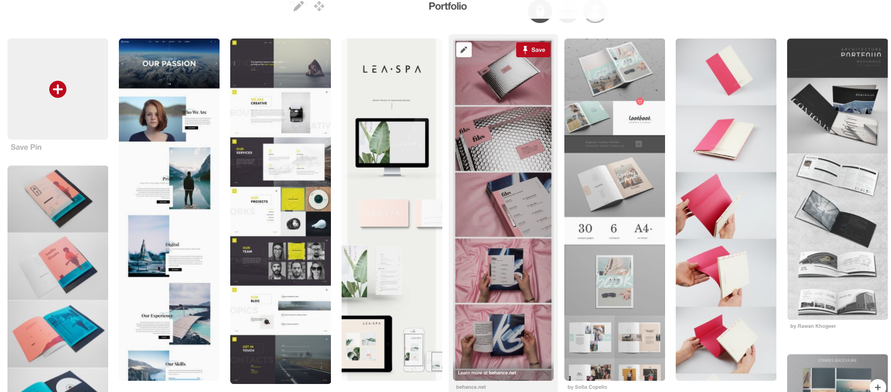
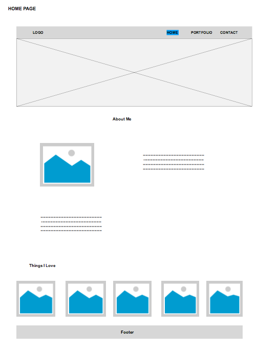
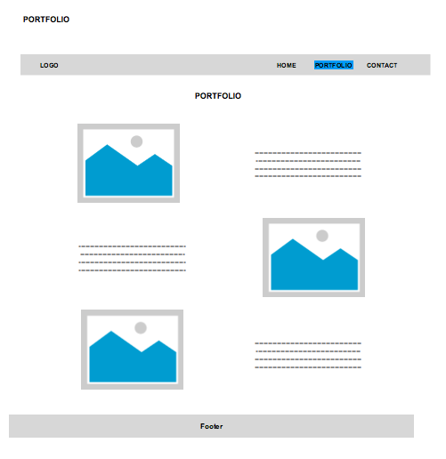
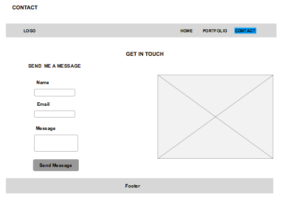

# Portfolio 

This is the repository for my portfolio website. So far the site is static, built with HTML and CSS files, it's fully responsive and follows mobile first approach.

I have kept the below point as my guiding principle while building this portfolio

***Display compelling content and provide basic information that leads to getting hired.***

Personal portfolio website is all about promoting you. You are a brand, and your name is a brand name. No one is going to know about your brand unless you get it out there; and if you’re a Web designer, developer, writer, gamer or any other type of creative, then **it’s essential that you have a good portfolio website.**

## About design decisions

Building an online portfolio is all about it establishes credibility and expands your professional network, I have covered below aspects in my portfolio,

* Who you are
* What kind of work you do
* How you do that work
* Where you want to go next

## Usability 

Portfolio website doesn’t have to be complicated, but a simple design can get lost in the noise. 
The #1 goal was to come up with a simple user experience, not a pretty design or fancy typography. I concentrated on the deisgn to make it more usable by giving special attention to below sections that are quite critical

* **Portfolios That Sell**

   The one golden rule with a portfolio site is this; keep attention on the work.

* **Simple Layout Styles**

   Portfolios often work better with **minimalism** because this style places      the greatest focus on usability and the work  itself.Detailed graphics and      complex patterns may be fun to design, but they aren’t always the best       choice for a website.
  
  
* **Clear thumbnails grid**

    Thumbnails allow visitors to select what they want to see, rather than      being forced to continually scroll through embedded    images or videos
  
* **Colors and typography**

   The colors and typography make the design feel very approachable.

## Building blocks

### Logo

Logo is usually the first thing a user sees. In the Western world, we read from left to right, top to bottom, so it makes sense to put your logo in the top left of your website so that users can immediately identify who owns the website.

### Tagline

Once the user sees who owns the website, they’ll want to know what it is you do. This is where you explain what you do with a tagline. **Your tagline should be short and snappy, summarizing what you do**.

### Portfolio (Work)

This is a personal portfolio website after all, so your portfolio will determine whether the website is interesting or not.
Portfolio should contain **big high-quality images**, clearly accessible to the user and **linked to the live version** of the website you worked on.

### About Me

It’s all about you. Let people see the man or woman behind the mask (i.e. website). Share your background, where you came from, how many years you’ve been in the business, etc. **The more details you give, the better your users can form a bond and build trust with you.**

### Contact

Your contact information should be **obvious and easy to access**; don’t hide it in the footer. Let people know they can contact you for a quote or a chat. **Use a form** to make it easier for users to contact you (so that they don’t have to take down your email address and then open up their email manager). A form also allows you to **ask for specific information**, such as name, email address, details of inquiry.

### Use social networking sites

Now that people have an interest in you and your work, encourage them to follow you on other websites. **Make it clear that they can follow you on Twitter, Facebook, Flickr, LinkedIn**, etc. Make the most of social networks.

## Design Methodology Followed

### Pintrest Mood board
This design is finalised based on the inspirations that I drew from quite few deisgn on the web , I have collated them in a pinterest moodboard. 

https://au.pinterest.com/reenavg33/portfolio/

### Style guide
I have followed a consitent style guide that I created for this portfolio. checkout the [style guide](https://patilreena.github.io/style-guide/).

### Wireframe

